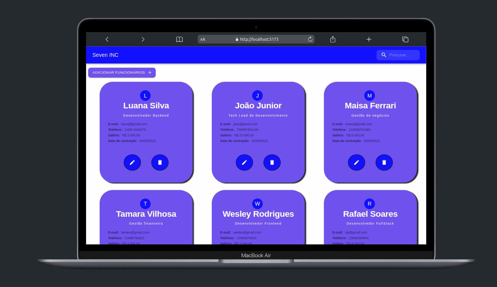

<h1 align="center"> <strong>7️⃣  Seven INC</strong></h1>

<p align="center">

</p>

<br />
<p align="center"></p>

<br />
<p align="center"></p>
<br/>

# 📕 Sobre

✍️ Seven INC é sistema de gerenciamento de funcionários.
</br>

# 🛠️Technologies

This project was made using the follow technologies:

- [TypeScript](https://www.typescriptlang.org/)
- [React](https://reactjs.org)
- [Material UI](https://mui.com/pt/)
- [Formik](https://formik.org/)
- [ViteJS](https://vitejs.dev/)

# 🚀Features

- Visualizar funcionários
- Criar novos funcionários
- Editar funcionários
- Deletar funcionários

# 🏃Getting Started

```sh
#  Clone Repository
$ git clone https://github.com/wesleywcr/SevenINC.git
```

```sh
# Install Dependencies
$ yarn install
# Start application
$ yarn dev
```

# 📝License

Released in 2022.
Made with ❤️ by [Wesley Rodrigues](https://github.com/wesleywcr)🤙👊
